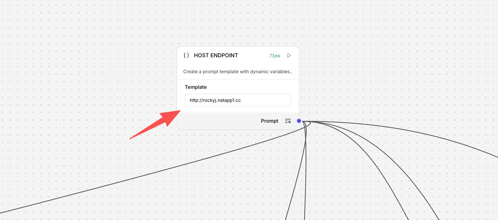

# AIVidFromPPT

An AI video generation service based on FastAPI that supports a complete workflow from PPT to video, including PPT parsing, text-to-speech, video synthesis, and virtual human functionality.

This project provides API interface services for the Maker platform. After deployment, you need to configure the public network address to the Maker's HOST ENDPOINT node to call this service's API interfaces in Maker workflows.

## ✨ Features

- 📄 **PPT Parsing & Processing** - Convert PPT/PPTX files to images with context management
- 🔊 **Text-to-Speech (TTS)** - Support for multiple TTS providers with automatic subtitle generation
- 📤 **File Upload Management** - Upload, download, and manage various file types
- 🎬 **Video Synthesis** - Combine images, audio, subtitles, and virtual human videos into complete videos
- 👤 **Virtual Human Synthesis** - Generate virtual human videos with lip-sync based on text

## 🚀 Quick Start

### Requirements

- Python 3.11+
- Docker (optional, for containerized deployment)

### Source Code Setup

1. **Clone the repository**

```bash
git clone <repository-url>
cd hackathon-AIVidFromPPT
```

2. **Install system dependencies**

The project requires the following system tools. Install them according to your operating system:

#### macOS

```bash
# Install using Homebrew
brew install libreoffice poppler ffmpeg fontconfig
```

#### Linux (Ubuntu/Debian)

```bash
sudo apt-get update
sudo apt-get install -y \
    libreoffice \
    libreoffice-writer \
    libreoffice-impress \
    poppler-utils \
    ffmpeg \
    fontconfig
```

#### Windows

- **LibreOffice**: Download and install from [official website](https://www.libreoffice.org/download/)
- **Poppler**: Download from [GitHub](https://github.com/oschwartz10612/poppler-windows/releases), extract and add to PATH
- **FFmpeg**: Download from [official website](https://ffmpeg.org/download.html), extract and add to PATH
- **Fontconfig**: Usually included in the system

**Notes**:
- `libreoffice` - For converting PPT/PPTX files to images
- `poppler-utils` - For PDF processing and image extraction
- `ffmpeg` - For video and audio processing
- `fontconfig` - For font management (Chinese font support)

3. **Create virtual environment**

```bash
conda create -n aividfromppt python=3.11 -y
conda activate aividfromppt
```

4. **Install Python dependencies**

```bash
cd server
pip install -r requirements.txt
```

5. **Configure environment variables**

Create a `.env` file (or copy from `.env.example`):

```bash
OPENAI_API_KEY=your-openai-api-key-here
```

6. **Start the service**

```bash
uvicorn main:app --host 0.0.0.0 --port 8201 --reload
```

7. **Access API documentation**

Open your browser and visit: http://localhost:8201/docs

## 🐳 Docker Deployment

### Server Configuration Recommendations

To ensure stable service operation, it is recommended to use a cloud server with the following configuration:

- **Recommended Configuration**: 8 CPU cores + 16GB RAM
- **Minimum Configuration**: 4 CPU cores + 8GB RAM
- **Storage**: At least 50GB available space (for storing uploaded files and generated videos)

**Notes**:
- Video synthesis and virtual human generation are compute-intensive tasks that require sufficient CPU and memory resources
- Larger memory helps process large PPT files and video files
- Sufficient storage space is needed to save user-uploaded files and generated videos

### Using environment variables

```bash
docker run -d \
  --name aividfromppt \
  --restart=always \
  -p 8201:8201 \
  -e OPENAI_API_KEY="your-openai-api-key-here" \
  -v $(pwd)/server/uploads:/app/uploads \
  unhejing/aividfromppt:latest
```

## 📚 API Documentation

All API endpoints follow RESTful conventions with base path `/api/v1`.

### PPT Parsing & Processing (`/api/v1/pptToImg`)

- `POST /upload` - Upload PPT/PPTX file and convert to images
- `GET /image` - Get converted images
- `POST /context` - Add context data
- `PUT /context` - Update context data
- `DELETE /context` - Delete context data
- `GET /context/{uuid}` - Get context data

### Text-to-Speech (`/api/v1/tts`)

- `POST /synthesize` - Text-to-speech synthesis
  - Supports OpenAI TTS
  - Automatically generates SRT subtitle files
  - Returns audio file URL and metadata
- `GET /files/{file_path}` - Get audio or subtitle files
- `GET /channels` - Get list of supported TTS channels

### File Upload (`/api/v1/upload`)

- `POST /file` - Upload a single file (max 50MB)
- `POST /files` - Upload multiple files
- `GET /files/{file_path}` - Get uploaded file
- `DELETE /file/{file_path}` - Delete file
- `GET /list` - List all uploaded files

Supported file types: images, documents, videos, audio, subtitles, archives, etc.

### Video Synthesis (`/api/v1/video`)

- `POST /synthesize` - Synthesize video
  - Supports multi-segment video synthesis
  - Supports overlaying images, audio, subtitles, and virtual human videos
  - Returns video ID and access URL
- `GET /{video_id}` - Get video information
- `GET /{video_id}/download` - Download video file
- `GET /health` - Health check

### Virtual Human (`/api/v1/virtual`)

- `POST /generate-video` - Generate virtual human video
  - Generate lip-sync video based on text
  - Supports Chinese and English mixed content
  - Supports gender selection

## 🛠️ Tech Stack

- **Web Framework**: FastAPI
- **Python Version**: 3.11
- **Main Dependencies**:
  - OpenAI API (TTS)
  - MoviePy (Video processing)
  - PyMuPDF (PDF processing)
  - LibreOffice (PPT conversion)
  - FFmpeg (Video/audio processing)

## 📁 Project Structure

```
hackathon-AIVidFromPPT/
├── server/                 # Backend service
│   ├── pptToImg/          # PPT parsing and processing
│   ├── tts/               # Text-to-speech
│   ├── upload/            # File upload management
│   ├── video/             # Video synthesis
│   ├── virtual/           # Virtual human synthesis
│   ├── main.py            # Application entry point
│   └── requirements.txt   # Python dependencies
├── .setup/                # Deployment configuration
│   ├── Dockerfile         # Docker image build
│   └── build_and_push_dockerhub.sh  # Image build script
├── docs/                  # Project documentation
└── README.md              # Project description
```

## 📝 Environment Variables

| Variable | Required | Description | Default |
|----------|----------|-------------|---------|
| `OPENAI_API_KEY` | ✅ | OpenAI API key | None |

## 🔧 Maker Configuration

### HOST ENDPOINT Configuration

After deployment, you need to configure the HOST ENDPOINT node in the Maker platform:

1. Get the public network address of your service (e.g., `http://your-domain.com` or `http://your-ip:8201`)
2. Add a HOST ENDPOINT node in your Maker workflow
3. Enter the public network address in the node configuration

Configuration example:



**Configuration Notes**:
- Enter the public network address in the Template field, e.g., `http://rockyj.natapp1.cc`
- Ensure the service is properly deployed and accessible from the public network
- After configuration, you can call all API interfaces of this service in Maker workflows

## 🎬 Demo Videos

The following are example video results generated by calling this service through the Maker platform:

> **Note**: GitHub README does not support direct video playback. Please click the links below to download and view the videos, or use a Markdown viewer that supports video playback.

### Source File

📄 [Download Original PPT File](./resource/test.pptx) - This is the source file used to generate the videos

### Chinese Demo

📹 [Download Chinese Demo Video](./resource/cn_video_res.mp4)

### English Demo

📹 [Download English Demo Video](./resource/en_video_res.mp4)

### Portuguese Demo

📹 [Download Portuguese Demo Video](./resource/pt_video_res.mp4)

## 🔗 Related Links

- API Documentation: http://localhost:8201/docs
- Interactive API Documentation: http://localhost:8201/redoc

