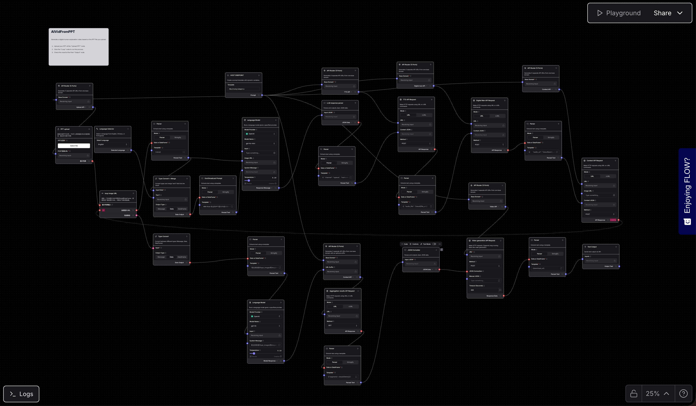

**语言 / Language / Idioma**: [中文](README_CN.md) | [English](README.md) | [Português](README_PT.md)

# AIVidFromPPT

一个基于 FastAPI 的 AI 视频生成服务，支持从 PPT 到视频的完整工作流，包括 PPT 解析、文本转语音、视频合成和虚拟数字人功能。

本项目为 Maker 平台提供 API 接口服务。部署完成后，需要使用公网地址配置到 Maker 的 HOST ENDPOINT 节点，以便在 Maker 工作流中调用本服务的 API 接口。

## ✨ 功能特性

- 📄 **PPT 解析与处理** - 将 PPT/PPTX 文件转换为图片，支持上下文管理
- 🔊 **文本转语音 (TTS)** - 支持多种 TTS 提供商，自动生成字幕文件
- 📤 **文件上传管理** - 支持多种文件类型上传、下载和管理
- 🎬 **视频合成** - 将图片、音频、字幕和虚拟数字人视频合成为完整视频
- 👤 **虚拟数字人合成** - 基于文本生成带口型同步的虚拟数字人视频

## 🚀 快速开始

### 环境要求

- Python 3.11+
- Docker (可选，用于容器化部署)

### 源码启动

1. **克隆项目**

```bash
git clone <repository-url>
cd hackathon-AIVidFromPPT
```

2. **安装系统依赖**

项目需要以下系统工具，请根据你的操作系统安装：

#### macOS

```bash
# 使用 Homebrew 安装
brew install libreoffice poppler ffmpeg fontconfig
```

#### Linux (Ubuntu/Debian)

```bash
sudo apt-get update
sudo apt-get install -y \
    libreoffice \
    libreoffice-writer \
    libreoffice-impress \
    poppler-utils \
    ffmpeg \
    fontconfig
```

#### Windows

- **LibreOffice**: 从 [官网](https://www.libreoffice.org/download/) 下载安装
- **Poppler**: 从 [GitHub](https://github.com/oschwartz10612/poppler-windows/releases) 下载，解压后添加到 PATH
- **FFmpeg**: 从 [官网](https://ffmpeg.org/download.html) 下载，解压后添加到 PATH
- **Fontconfig**: 通常已包含在系统中

**说明**：
- `libreoffice` - 用于 PPT/PPTX 文件转换为图片
- `poppler-utils` - 用于 PDF 处理和图片提取
- `ffmpeg` - 用于视频和音频处理
- `fontconfig` - 用于字体管理（中文字体支持）

3. **创建虚拟环境**

```bash
conda create -n aividfromppt python=3.11 -y
conda activate aividfromppt
```

4. **安装 Python 依赖**

```bash
cd server
pip install -r requirements.txt
```

5. **配置环境变量**

创建 `.env` 文件（或从 `.env.example` 复制）：

```bash
OPENAI_API_KEY=your-openai-api-key-here
```

6. **启动服务**

```bash
uvicorn main:app --host 0.0.0.0 --port 8201 --reload
```

7. **访问 API 文档**

打开浏览器访问：http://localhost:8201/docs

## 🐳 Docker 部署

### 服务器配置建议

为了确保服务稳定运行，建议使用以下配置的云服务器：

- **推荐配置**: 8 核 CPU + 16GB 内存
- **最低配置**: 4 核 CPU + 8GB 内存
- **存储**: 建议至少 50GB 可用空间（用于存储上传的文件和生成的视频）

**说明**：
- 视频合成和虚拟数字人生成是计算密集型任务，需要足够的 CPU 和内存资源
- 较大的内存有助于处理大型 PPT 文件和视频文件
- 足够的存储空间用于保存用户上传的文件和生成的视频

### 使用环境变量文件

```bash
docker run -d \
  --name aividfromppt \
  --restart=always \
  -p 8201:8201 \
  -e OPENAI_API_KEY="your-openai-api-key-here" \
  -v $(pwd)/server/uploads:/app/uploads \
  unhejing/aividfromppt:latest
```

### 🌐 在线服务（无需本地部署）

如果您本地没有部署环境，可以直接使用我们提供的在线服务进行测试：

- **服务地址**: `http://154.40.41.212:8201`
- **API 文档**: `http://154.40.41.212:8201/docs`
- **交互式文档**: `http://154.40.41.212:8201/redoc`

**使用说明**：
- 所有 API 接口都可以通过上述地址直接访问
- 在 Maker 平台配置 HOST ENDPOINT 时，使用 `http://154.40.41.212:8201` 作为服务地址
- 无需安装任何依赖或配置环境，开箱即用

> ⚠️ **重要提示**：由于服务器资源限制，使用在线服务进行 Maker 测试时，请确保上传的 PPT 文件不超过 5 页，以确保服务稳定运行。

## 📚 API 文档

所有 API 接口都遵循 RESTful 规范，基础路径为 `/api/v1`。

### PPT 解析与处理 (`/api/v1/pptToImg`)

- `POST /upload` - 上传 PPT/PPTX 文件并转换为图片
- `GET /image` - 获取转换后的图片
- `POST /context` - 添加上下文数据
- `PUT /context` - 更新上下文数据
- `DELETE /context` - 删除上下文数据
- `GET /context/{uuid}` - 获取上下文数据

### 文本转语音 (`/api/v1/tts`)

- `POST /synthesize` - 文本转语音合成
  - 支持 OpenAI TTS
  - 自动生成 SRT 字幕文件
  - 返回音频文件 URL 和元数据
- `GET /files/{file_path}` - 获取音频或字幕文件
- `GET /channels` - 获取支持的 TTS 渠道列表

### 文件上传 (`/api/v1/upload`)

- `POST /file` - 上传单个文件（最大 50MB）
- `POST /files` - 批量上传文件
- `GET /files/{file_path}` - 获取上传的文件
- `DELETE /file/{file_path}` - 删除文件
- `GET /list` - 列出所有上传的文件

支持的文件类型：图片、文档、视频、音频、字幕、压缩包等。

### 视频合成 (`/api/v1/video`)

- `POST /synthesize` - 合成视频
  - 支持多段视频合成
  - 支持图片、音频、字幕和虚拟数字人视频叠加
  - 返回视频 ID 和访问 URL
- `GET /{video_id}` - 获取视频信息
- `GET /{video_id}/download` - 下载视频文件
- `GET /health` - 健康检查

### 虚拟数字人 (`/api/v1/virtual`)

- `POST /generate` - 生成虚拟数字人视频
  - 基于文本生成带口型同步的视频
  - 支持中英文混合
  - 支持性别选择

## 🛠️ 技术栈

- **Web 框架**: FastAPI
- **Python 版本**: 3.11
- **主要依赖**:
  - OpenAI API (TTS)
  - MoviePy (视频处理)
  - PyMuPDF (PDF 处理)
  - LibreOffice (PPT 转换)
  - FFmpeg (视频/音频处理)

## 📁 项目结构

```
hackathon-AIVidFromPPT/
├── server/                 # 后端服务
│   ├── pptToImg/          # PPT 解析和处理
│   ├── tts/               # 文本转语音
│   ├── upload/            # 文件上传管理
│   ├── video/             # 视频合成
│   ├── virtual/           # 虚拟数字人合成
│   ├── main.py            # 应用入口
│   └── requirements.txt   # Python 依赖
├── .setup/                # 部署配置
│   ├── Dockerfile         # Docker 镜像构建
│   └── build_and_push_dockerhub.sh  # 镜像构建脚本
├── docs/                  # 项目文档
└── README.md              # 项目说明
```

## 📝 环境变量

| 变量名 | 必填 | 说明 | 默认值 |
|--------|------|------|--------|
| `OPENAI_API_KEY` | ✅ | OpenAI API 密钥 | 无 |

## 🔧 Maker 配置

### HOST ENDPOINT 配置

部署完成后，需要在 Maker 平台配置 HOST ENDPOINT 节点：

1. 获取服务的公网地址（例如：`http://your-domain.com` 或 `http://your-ip:8201`）
2. 在 Maker 工作流中添加 HOST ENDPOINT 节点
3. 在节点配置中填入服务的公网地址

配置示例：


**配置说明**：
- Template 字段填入服务的公网地址，例如：`http://154.40.41.212:8201`
- 确保服务已正确部署并可公网访问
- 配置完成后，即可在 Maker 工作流中调用本服务的所有 API 接口

### Maker 工作流

我们提供了完整的 Maker 工作流配置文件，您可以直接导入使用：

📄 [下载 Maker 工作流源文件](./maker/AIVidFromPPT.json) - 包含完整的工作流配置



**使用说明**：
1. 下载工作流源文件 `AIVidFromPPT.json`
2. 在 Maker 平台中导入该工作流
3. 根据实际情况修改 HOST ENDPOINT 配置中的服务地址
4. 运行工作流即可开始使用

> ⚠️ **重要提示**：由于服务器资源限制，使用在线服务测试时，请确保上传的 PPT 文件不超过 5 页。

## 🎬 结果展示

以下是使用 Maker 平台调用本服务生成的视频结果示例：

> **注意**：GitHub README 不支持直接播放视频。请点击下方链接下载视频后查看，或使用支持视频播放的 Markdown 查看器。

### 原始文件

📄 [下载原始 PPT 文件](./resource/test.pptx) - 这是生成视频的源文件

### 中文示例

📹 [下载中文演示视频](./resource/cn_video_res.mp4)

### 英文示例

📹 [下载英文演示视频](./resource/en_video_res.mp4)

### 葡萄牙语示例

📹 [下载葡萄牙语演示视频](./resource/pt_video_res.mp4)

## 🔗 相关链接

- API 文档: http://154.40.41.212:8201/docs
- 交互式 API 文档: http://154.40.41.212:8201/redoc
